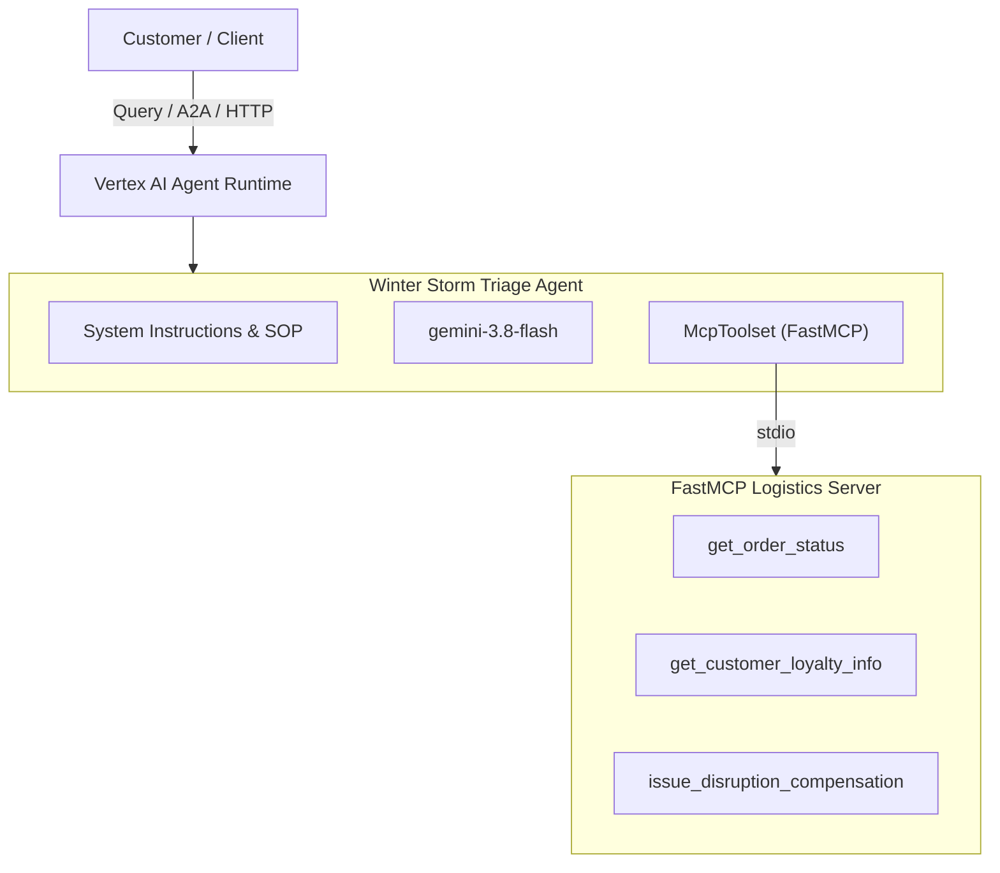

# Winter Storm Triage Agent ❄️📦

> An intelligent, autonomous customer support agent built with the **Google Agent Development Kit (ADK)** and **Model Context Protocol (MCP)**, powered by **Gemini 3.8 Flash** and deployed on **Google Cloud Vertex AI Agent Runtime**.


---

## 📌 Overview

The **Winter Storm Triage Agent** is designed for **Cymbal Direct** customer operations to automate end-to-end resolution of shipment disruptions caused by severe winter storms. When customers inquire about delayed orders, the agent automatically:

1. **Queries Order Status**: Connects to the Cymbal Logistics FastMCP server to verify if an order is delayed due to winter weather.
2. **Retrieves Customer Loyalty Profile**: Looks up the customer's membership tier (Platinum, Gold, Silver, or Member).
3. **Applies Policy-Based Compensation**: Issues the appropriate account credit and complimentary expedited shipping upgrade.
4. **Delivers Empathetic Communication**: Formulates a warm, personalized, professional response acknowledging the customer's loyalty.

---

## 🏗️ Architecture



---

## 📋 Winter Storm Triage Policy (SOP)

| Loyalty Tier | Disruption Account Credit | Complimentary Shipping Upgrade |
|---|---|---|
| 💎 **Platinum** | **$100 credit** | **Next-Day Air** |
| 🥇 **Gold** | **$50 credit** | **Next-Day Air** |
| 🥈 **Silver** | **$25 credit** | **3-Day Select** |
| 👤 **Member** | **$10 credit** | **Priority Shipping** |

*Note: Non-delayed deliveries are handled gracefully without issuing compensation.*

---

## 🎬 Working Examples

### Example 1: Gold Member with Storm Delay (`CYM-EC-9921`)

**Input Prompt:**
```bash
agents-cli run "What is the status of order CYM-EC-9921?"
```

**Tool Execution Trace:**
```
[tool_call: get_order_status({"order_id": "CYM-EC-9921"})]
[tool_response: get_order_status -> "Order CYM-EC-9921 is DELAYED. Reason: Severe winter storm at East Coast fulfillment center.. Customer ID: CUST-7742"]

[tool_call: get_customer_loyalty_info({"customer_id": "CUST-7742"})]
[tool_response: get_customer_loyalty_info -> "Customer CUST-7742 is in the GOLD tier."]

[tool_call: issue_disruption_compensation({"customer_id": "CUST-7742", "compensation_amount": "$50", "shipping_upgrade": "Next-Day Air"})]
[tool_response: issue_disruption_compensation -> "Successfully issued $50 credit and Next-Day Air shipping upgrade to CUST-7742."]
```

**Agent Response:**
> Dear Customer,
> 
> Thank you for reaching out regarding order **CYM-EC-9921**. 
> 
> I sincerely apologize for the delay in your shipment. Operations at our East Coast fulfillment center have been severely disrupted by a winter storm. We understand how frustrating unexpected delays can be, and we are truly sorry for the inconvenience.
> 
> Because of your valued status as a **Gold** loyalty member, we have taken immediate action:
> - A **$50 credit** has been applied to your account.
> - Your order has been upgraded to complimentary **Next-Day Air** shipping to expedite delivery once safe transit resumes.
> 
> Warm regards,  
> **Cymbal Direct Customer Care**

---

### Example 2: Platinum Member with Storm Delay (`CYM-EC-1002`)

**Input Prompt:**
```bash
agents-cli run "What is the status of order CYM-EC-1002?"
```

**Resolution:**
- Verified order `CYM-EC-1002` delayed for customer `CUST-1002`.
- Loyalty tier retrieved: **Platinum**.
- Applied **$100 credit** and **Next-Day Air** shipping upgrade.

---

### Example 3: Delivered Order (`CYM-EC-1001`)

**Input Prompt:**
```bash
agents-cli run "What is the status of order CYM-EC-1001?"
```

**Resolution:**
- Verified order `CYM-EC-1001` status is `DELIVERED`.
- Confirmed delivery with customer without triggering unnecessary compensation.

---

## 🚀 Quick Start & Local Development

### Prerequisites
- Python 3.12+
- [`uv`](https://docs.astral.sh/uv/) package manager
- `google-agents-cli`:
  ```bash
  uv tool install google-agents-cli
  ```

### 1. Install Dependencies
```bash
agents-cli install
```

### 2. Run Locally in CLI
```bash
agents-cli run "What is the status of order CYM-EC-9921?"
```

### 3. Launch Interactive Web Playground
```bash
agents-cli playground
```

### 4. Run Unit and Integration Tests
```bash
uv run pytest tests/unit tests/integration -v
```

### 5. Evaluate Response Quality
```bash
agents-cli eval run
```

### 6. Code Quality & Linting
```bash
agents-cli lint
```

---

## ☁️ Cloud Deployment (Agent Runtime)

The agent is deployed as a containerized Reasoning Engine on **Google Cloud Vertex AI Agent Runtime**:

### Deploy Command
```bash
agents-cli deploy --region us-west1 --no-confirm-project
```

### Query the Live Deployed Agent
```bash
agents-cli run \
  --url "https://us-west1-aiplatform.googleapis.com/v1/projects/519180330931/locations/us-west1/reasoningEngines/6878865800761966592" \
  --mode adk \
  "What is the status of order CYM-EC-9921?"
```

### Deployment Metadata
- **Region**: `us-west1`
- **Reasoning Engine ID**: `projects/519180330931/locations/us-west1/reasoningEngines/6878865800761966592`
- **Service Account**: `service-519180330931@gcp-sa-aiplatform-re.iam.gserviceaccount.com`
- **Agent Card (A2A)**: `https://us-west1-aiplatform.googleapis.com/reasoningEngines/v1/projects/519180330931/locations/us-west1/reasoningEngines/6878865800761966592/api/a2a/app/.well-known/agent-card.json`

---

## 📁 Repository Structure

```
winter-storm-triage/
├── app/
│   ├── agent.py               # Main ADK agent logic with FastMCP toolset integration
│   ├── cymbal_direct_mcp.py   # Bundled FastMCP server for logistics and compensation
│   ├── fast_api_app.py        # FastAPI server with A2A & Reasoning Engine routes
│   └── app_utils/             # Adapters, telemetry, and service bindings
├── tests/
│   ├── eval/                  # Quality evaluation datasets and metrics
│   ├── integration/           # E2E server and agent streaming tests
│   └── unit/                  # Unit tests
├── Dockerfile                 # Production container image definition
├── pyproject.toml             # Dependencies (google-adk, fastmcp, mcp)
├── agents-cli-manifest.yaml   # Project deployment and infrastructure manifest
├── deployment_metadata.json   # Recorded deployment metadata
└── demo.svg                   # Animated terminal demo recording
```
